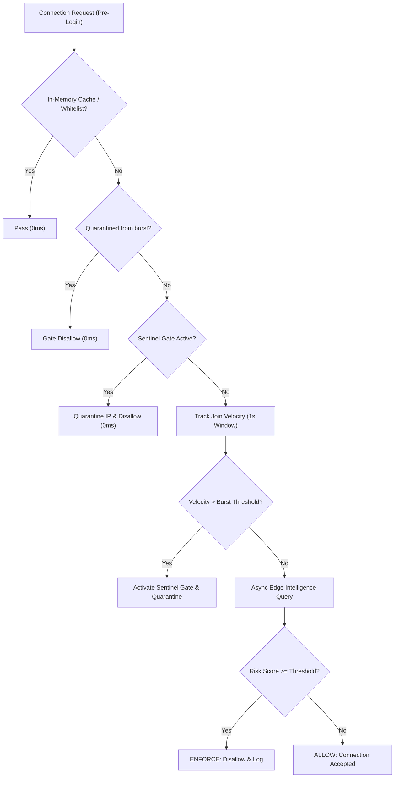

# Sentinel Minecraft Connector

<p align="center">
  <a href="https://github.com/antivpn-tech/sentinel-mc/releases"></a>
  <a href="https://kotlinlang.org"></a>
  <a href="https://papermc.io"></a>
  <a href="https://antivpn.tech"></a>
  <a href="https://opensource.org/licenses/MIT"></a>
</p>

Sentinel Minecraft Connector is the official universal Kotlin connector linking Minecraft servers and proxy networks directly to the Sentinel Edge Intelligence Network ([antivpn.tech](https://antivpn.tech)).

It provides low-latency proxy and VPN detection, routing preservation for gaming optimizers (ExitLag, WTFast, etc.), and Sentinel Gate anti-bot join velocity protection. Delivered as a single universal JAR for Velocity, BungeeCord, Waterfall, Paper, Purpur, Spigot, and Bukkit.

---

## Key Capabilities

- **Universal Drop-in Binary**: Single artifact automatically initializes on Velocity 3.3+, BungeeCord, Waterfall, and Paper / Purpur / Spigot 1.8 through 1.21+.
- **Fail-Open Architecture**: Asynchronous non-blocking HTTP/2 queries. If the edge network or remote API is unreachable, queries resolve to `ALLOW` to prevent blocking legitimate players.
- **Sentinel Gate Join Rate Limiting**: In-memory sliding-window join tracking throttles rapid connection floods from unverified IPs and enforces temporary quarantine cooldowns before thread pools can be saturated.
- **Gaming Optimizer Bypass**: Preserves competitive players utilizing latency routing services (ExitLag, WTFast, NoPing, Mudfish, GearUP) from false positives.
- **Batched Discord Telemetry**: Rate-limit-aware webhook dispatcher consolidates attack waves into structured digest embeds, preventing HTTP 429 webhook drops during floods.
- **In-Memory Cache**: High-throughput memory cache eliminates redundant API queries during player reconnects or proxy server switches.
- **Local Lists**: Administrative `/sentinel` commands for in-game IP and username whitelisting and blacklisting.

---

## Sentinel Gate Architecture

Conventional anti-VPN plugins initiate external HTTP queries for every connecting client during an attack, risking thread exhaustion and connection timeouts.

Sentinel Gate intercepts connection floods in memory prior to external network dispatch:



1. **Sliding-Window Velocity Tracking**: Unverified connections are tracked across a 1,000ms window.
2. **Gate Activation**: When connection velocity exceeds the threshold (default: 5 connections/second), Sentinel Gate engages for 15 seconds.
3. **Quarantine Cooldown**: Unverified IPs attempting connection while the gate is active are quarantined for 60 seconds to suppress retry floods.
4. **Legitimate Player Exemption**: Existing authenticated players and cached residential connections bypass the gate entirely.

---

## Authentication and Licenses

To connect to the Sentinel intelligence network:

1. Create an account at [antivpn.tech](https://antivpn.tech).
2. Generate an API license key from the dashboard (Developer, Starter, or Enterprise).
3. Insert your license key (`stl_live_...`) into `plugins/Sentinel/config.yml`.

---

## Installation

1. Download `Sentinel-Minecraft-1.0.0.jar` from the [Releases](https://github.com/antivpn-tech/sentinel-mc/releases) page.
2. Place the JAR into your server's `plugins/` directory:
   - Velocity: `/plugins/Sentinel-Minecraft-1.0.0.jar`
   - BungeeCord / Waterfall: `/plugins/Sentinel-Minecraft-1.0.0.jar`
   - Paper / Purpur / Spigot: `/plugins/Sentinel-Minecraft-1.0.0.jar`
3. Start the server to generate default configurations.
4. Configure your license key in `plugins/Sentinel/config.yml` (or `plugins/sentinel/config.yml` on Velocity).
5. Execute `/sentinel reload` to apply settings.

---

## Configuration Reference

```yaml
# ==============================================================================
#                 Sentinel Anti-VPN Protection Configuration
#                        https://antivpn.tech
# ==============================================================================

api:
  # Sentinel Edge Intelligence API endpoint
  endpoint: "https://api.antivpn.tech/v1/check"

  # Your Sentinel License Key (Claim your free Developer key at https://antivpn.tech)
  license-key: "stl_live_your_api_key_here"

  # HTTP connection timeout in milliseconds
  timeout-ms: 2500

# ------------------------------------------------------------------------------
# Protection Mode:
# ENFORCE - Active Blocking Mode (Default). Disallows proxy/VPN connections.
# AUDIT   - Passive Monitoring Mode. Logs detections without kicking players.
# ------------------------------------------------------------------------------
mode: "ENFORCE"

# Risk threshold (0 - 100). Commercial VPNs and proxies rate 85-100.
risk-threshold: 80

# Ignore gaming VPNs and ping optimizers (ExitLag, WTFast, NoPing, Mudfish, GearUP)
allow-gaming-optimizers: true

# In-memory IP cache duration in minutes
cache-duration-minutes: 30

# ------------------------------------------------------------------------------
# Sentinel Gate Join Rate Limiting & Anti-Bot Shield
# ------------------------------------------------------------------------------
anti-bot:
  enabled: true
  # Maximum new unverified connections per second before gate activates
  burst-threshold: 5
  # Duration in seconds to maintain gate mode during an attack
  shield-duration-seconds: 15
  # Duration in seconds to quarantine throttled bot IPs
  quarantine-seconds: 60
  # Disconnect message shown to throttled connections while gate is active
  kick-message: "&c&lSentinel Gate\n&7Gate active due to abnormal connection velocity.\n&7Please reconnect in a few seconds."

# ------------------------------------------------------------------------------
# Discord Webhook Telemetry
# ------------------------------------------------------------------------------
discord:
  enabled: true
  webhook-url: ""
  notify-only-on-threat: true
  server-name: "Minecraft Network"

# ------------------------------------------------------------------------------
# Enforcement Disconnect Screen
# Supports formatting with & and placeholders: %player%, %ip%, %threat%, %risk%
# ------------------------------------------------------------------------------
enforcement:
  kick-message: "&c&lSentinel Protection\n&7VPN / Proxy traffic is restricted on this server.\n&8Threat: &f%threat% &7| &8Risk: &f%risk%/100\n&7If you believe this is a false positive, please contact staff."
```

---

## Commands and Permissions

Administrative commands require the `sentinel.admin` permission (granted to server operators by default).

| Command | Description |
| :--- | :--- |
| `/sentinel status` | Displays active protection mode, cache volume, list counts, and webhook state. |
| `/sentinel reload` | Reloads `config.yml`, `whitelist.json`, and `blacklist.json`. |
| `/sentinel check <ip\|player>` | Queries live intelligence for an online player or target IP address. |
| `/sentinel whitelist list` | Lists all whitelisted usernames and IP addresses. |
| `/sentinel whitelist add <player\|ip>` | Adds a target to the whitelist (bypasses all checks). |
| `/sentinel whitelist remove <player\|ip>` | Removes a target from the whitelist. |
| `/sentinel blacklist list` | Lists all blacklisted usernames and IP addresses. |
| `/sentinel blacklist add <player\|ip>` | Adds a target to the blacklist (immediate rejection). |
| `/sentinel blacklist remove <player\|ip>` | Removes a target from the blacklist. |

---

## Building from Source

Requirements:
- JDK 17 or higher
- Apache Maven 3.8 or higher

```bash
git clone https://github.com/antivpn-tech/sentinel-mc.git
cd sentinel-mc
mvn clean package
```

The compiled universal JAR will be produced at `target/Sentinel-Minecraft-1.0.0.jar`.

---

## License

This project is licensed under the [MIT License](LICENSE).
